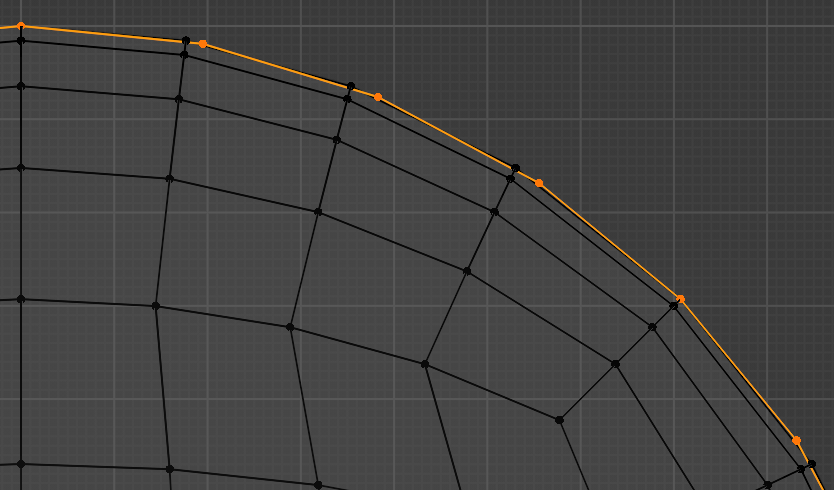
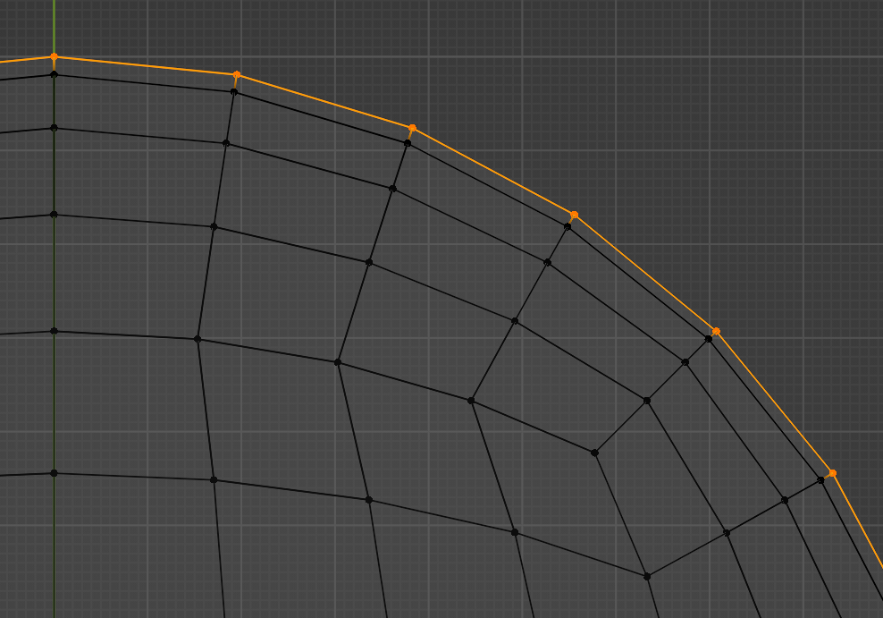

# Even Quad Sphere

Special case of quad sphere which maximizes equality of edge lengths.

Quad sphere from "Extra Objects" addon (unequal edge lengths even on axis-aligned circles):

Quad sphere from this addon (equal edge lengths on axis-aligned circles):

## Usage

Shift+A -> Mesh -> Even Quad Sphere
